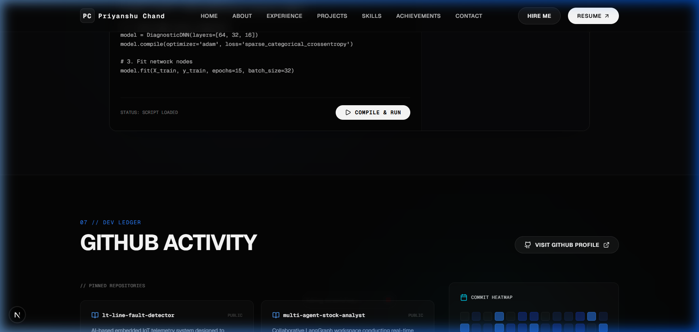
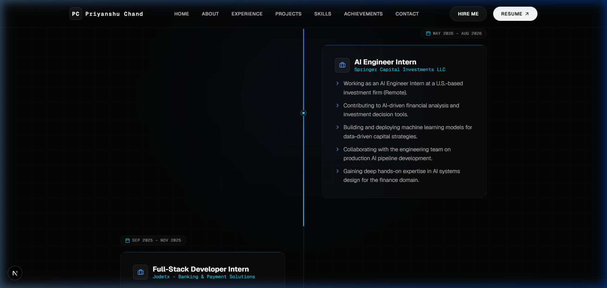
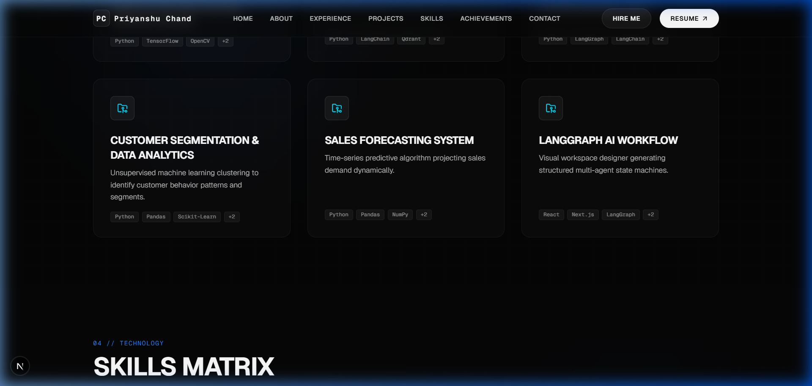

<div align="center">
  

  <br />
  
  <p align="center">
    <b>A cinematic, Awwwards-inspired personal portfolio showcasing my engineering journey, projects, and skills.</b>
  </p>

  <p align="center">
    <a href="https://nextjs.org/"></a>
    <a href="https://www.typescriptlang.org/"></a>
    <a href="https://tailwindcss.com/"></a>
    <a href="https://framer.com/motion"></a>
  </p>
</div>

---

<div align="center">
  
</div>

## 🌌 The Experience

This portfolio is not just a resume; it is an interactive engineering showcase designed to leave a lasting impression. Built with modern web architecture, it leverages **Next.js 16**, **Tailwind CSS v4**, and highly optimized **Framer Motion + GSAP** animations.

### ✨ Key Highlights

- 🛸 **Immersive 3D Interactions:** Neural-network background particles, orbiting rings, glitch typography, and magnetic hover elements.
- 💻 **Interactive Coding Desk:** A functional mock terminal that simulates neural net training outputs and handles bash-like commands (`help`, `about`, `skills`, `contact`).
- 🌊 **Fluid Inertial Scrolling:** Integrated Lenis smooth scroll for seamless navigation.
- 📱 **Fully Responsive:** Pixel-perfect rendering across all devices.
- 📩 **Web3Forms Integration:** Live, backend-less email delivery system for inquiries.

---

## 🛠️ Technology Stack

<div align="center">
  <a href="https://skillicons.dev">
    
  </a>
</div>

---

## 📸 Gallery

<div align="center">
  <table>
    <tr>
      <td width="50%">
        
        <br />
        <p align="center"><b>Neon Timeline</b></p>
      </td>
      <td width="50%">
        
        <br />
        <p align="center"><b>Mock Terminal</b></p>
      </td>
    </tr>
  </table>
</div>

---

## 🚀 Running Locally

Want to inspect the code? Running it locally is simple:

```bash
# 1. Clone the repository
git clone https://github.com/mystzoro/Portfolio.git

# 2. Enter directory
cd Portfolio

# 3. Install dependencies
npm install

# 4. Start the Turbopack dev server
npm run dev
```

> **Note on Email Forwarding:** To enable the contact form, grab a free API key from [Web3Forms](https://web3forms.com/) and place it in `src/components/Contact.tsx`.

---

## 👨‍💻 About The Author

I am a Computer Science student at DY Patil International University, Pune, driven by curiosity to build intelligent software. My focus lies at the intersection of **Artificial Intelligence**, **Data Analytics**, and **Modern Web Engineering**.

- 💼 **Incoming AI Engineer Intern** @ Springer Capital Investments LLC
- 🏆 **Winner** - Fyrst Ideation Challenge 2025
- 🤖 Specialized in **RAG, Multi-Agent Systems, and Predictive ML**

<div align="center">
  <br />
  <a href="https://linkedin.com/in/priyanshu-chand-283163271">
    
  </a>
  <a href="mailto:priyanshuchand101@gmail.com">
    
  </a>
  <a href="https://github.com/priyanshu-chand">
    
  </a>
</div>

<br />

<p align="center">
  
</p>
